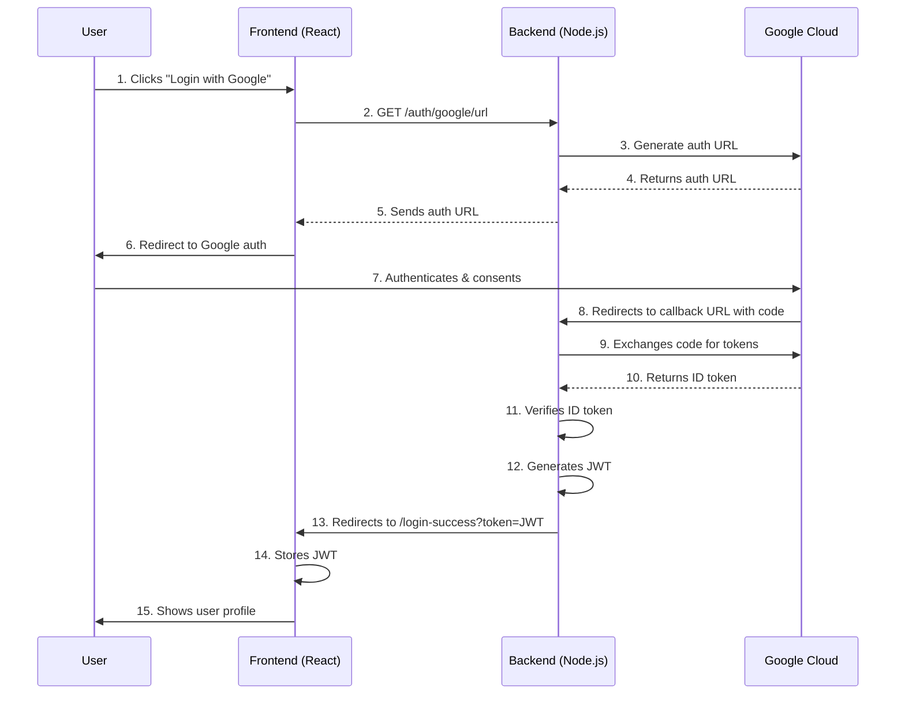

# Google OAuth Login with Node.js and React (Vite)

This project demonstrates a secure Google OAuth login implementation using Node.js backend and React frontend. It features the redirect flow for authentication, JWT token generation for session management, and user profile display.

## Sequence Diagram



## Prerequisites

- Node.js (v18+)
- npm (v9+)
- Google Cloud account
- Basic terminal knowledge

## Setup Guide

### 1. Google Cloud Setup

1. Go to [Google Cloud Console](https://console.cloud.google.com/)
2. Create a new project (e.g., "OAuth Demo")
3. Navigate to **APIs & Services** > **Credentials**
4. Click **Create Credentials** > **OAuth client ID**
5. Configure consent screen:
   - **Application type**: External
   - **Application name**: Your App Name
   - **Authorized domains**: `localhost` (add this)
   - **Developer email**: Your email
   - **Scopes**: `.../auth/userinfo.email`, `.../auth/userinfo.profile`, `openid`
   - **Test users**: Add your email
6. Create OAuth client ID:
   - **Application type**: Web application
   - **Name**: Google OAuth Demo
   - **Authorized JavaScript origins**: `http://localhost:5173`
   - **Authorized redirect URIs**: `http://localhost:5000/auth/google/callback`
7. Note down your **Client ID** and **Client Secret**

### 2. Backend Setup

```bash
# Clone repository
git clone https://github.com/yourusername/google-oauth-demo.git
cd google-oauth-demo/backend

# Install dependencies
npm install

# Create .env file
echo "GOOGLE_CLIENT_ID=your_client_id" >> .env
echo "GOOGLE_CLIENT_SECRET=your_client_secret" >> .env
echo "FRONTEND_URL=http://localhost:5173" >> .env
echo "JWT_SECRET=your_random_secret_key" >> .env
echo "GOOGLE_REDIRECT_URI=http://localhost:5000/auth/google/callback" >> .env
echo "PORT=5000" >> .env
```

### 3. Frontend Setup

```bash
cd ../frontend

# Install dependencies
npm install

# Create .env file
echo "VITE_BACKEND_URL=http://localhost:5000" >> .env
```

## Running the Application

1. Start backend server:

```bash
cd backend
node server.js
```

2. Start frontend development server:

```bash
cd ../frontend
npm run dev
```

3. Access the application at:  
   [http://localhost:5173](http://localhost:5173)

## Application Structure

```
google-oauth-demo/
├── backend/
│   ├── server.js       # Express server with OAuth routes
│   ├── package.json
│   └── .env            # Environment configuration
└── frontend/
    ├── src/
    │   ├── App.jsx     # Main application component
    │   ├── LoginSuccess.jsx # Login callback handler
    │   └── main.jsx    # Entry point
    ├── package.json
    └── .env            # Frontend environment variables
```

## Troubleshooting

1. **Redirect URI Mismatch**

   - Ensure redirect URI in Google Cloud matches exactly: `http://localhost:5000/auth/google/callback`
   - No trailing slashes

2. **CORS Errors**

   - Verify `FRONTEND_URL` in backend .env matches frontend URL (port 5173)
   - Restart backend after changes

3. **Invalid Tokens**

   - Ensure your system clock is synchronized
   - Check JWT secret matches in backend .env
   - Verify Google Client ID/Secret are correct

4. **Test User Issues**
   - Add your email as test user in Google Cloud consent screen
   - Use incognito mode for testing

## Security Best Practices

1. Use HTTPS in production
2. Rotate JWT secrets periodically
3. Implement refresh token rotation
4. Add CSRF protection
5. Set proper token expiration times (1 hour for access, 7 days for refresh)
6. Never expose client secrets in client-side code

## Next Steps

1. Add logout functionality with token revocation
2. Implement database integration for user profiles
3. Add support for multiple OAuth providers
4. Create protected routes
5. Implement refresh token rotation

## License

This project is licensed under the MIT License. See [LICENSE](LICENSE) for details.
